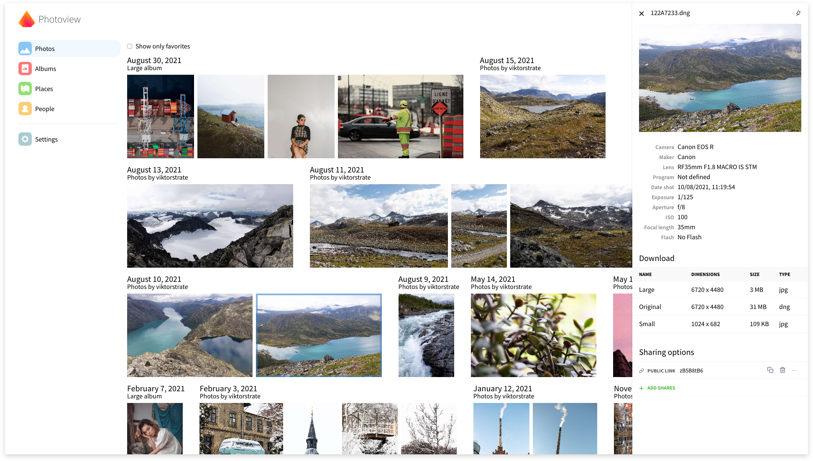
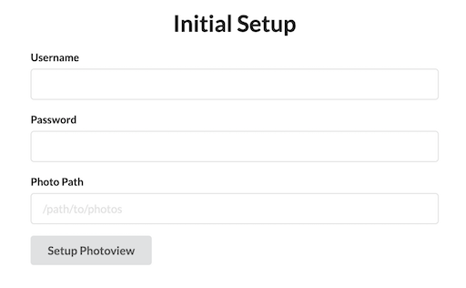

详细参考 官网https://photoview.github.io

修改源码已经可以支持 windows 版本(直接下载预编译的文件)

- [windows](https://github.com/zyq1569/photos/releases/tag/v1.0.0)

快速访问外网的途径 无界浏览 https://github.com/wujieliulan/forum


[](./LICENSE.md)



Photoview是一个简单且用户友好的照片库，专为摄影师设计，旨在提供一种简单快捷的方式来导航目录，其中包含数千张高分辨率照片。

您可以将 Photoview 配置为在文件系统上的目录中查找照片和视频。自动扫描您的媒体并开始生成缩略图图像，以使浏览速度超快。


## Demo site

Visit https://photos.qpqp.dk/

Username: **demo**
Password: **demo**

## Contents

- [Demo site](#demo-site)
- [Main features](#main-features)
- [Supported Platforms](#supported-platforms)
- [Why yet another self-hosted photo gallery](#why-yet-another-self-hosted-photo-gallery)
- [Getting started - Setup with Docker](#getting-started---setup-with-docker)
- [Set up development environment](#setup-development-environment)

## Main features

- **Closely tied to the file system**. The website presents the images found on the local filesystem of the server, directories are mapped to albums.
- **User management**. Each user is created along with a path on the local filesystem, photos within that path can be accessed by that user.
- **Sharing**. Albums, as well as individual media, can easily be shared with a public link, the link can optionally be password protected.
- **Made for photography**. Photoview is built with photographers in mind, and thus supports **RAW** file formats, and **EXIF** parsing.
- **Video support**. Many common video formats are supported. Videos will automatically be optimized for web.
- **Face recognition**. Faces will automatically be detected in photos, and photos of the same person will be grouped together.
- **Performant**. Thumbnails are automatically generated and photos first load when they are visible on the screen. In full screen, thumbnails are displayed until the high resolution image has been fully loaded.
- **Secure**. All media resources are protected with a cookie-token, all passwords are properly hashed, and the API uses a strict [CORS policy](https://developer.mozilla.org/en-US/docs/Web/HTTP/CORS).

## Supported platforms

- [Docker](https://hub.docker.com/r/viktorstrate/photoview/)
- [Arch Linux Aur](https://aur.archlinux.org/packages/photoview)
- [Unraid](https://forums.unraid.net/topic/103028-support-photoview-corneliousjd-repo/)
- EmbassyOS: [announcement](https://start9labs.medium.com/new-service-photoview-72ee681b2ff0), [repo](https://github.com/Start9Labs/embassyos-photoview-wrapper)
- [YunoHost](https://github.com/YunoHost-Apps/photoview_ynh)
- [windows](https://github.com/zyq1569/photos/releases/tag/v1.0.0)

## Why yet another self-hosted photo gallery

已经存在许多开源自托管照片库。这里有一些，仅举几例。

- [Piwigo](https://github.com/Piwigo/Piwigo)
- [LibrePhotos](https://github.com/LibrePhotos/librephotos)
- [Photoprism](https://github.com/photoprism/photoprism)
- [Lychee](https://github.com/LycheeOrg/Lychee)


## Getting started - Setup with Docker

> This section describes how to get Photoview up and running on your server with Docker.
> Make sure you have Docker and docker-compose installed and running on your server

1. Make a new `docker-compose.yml` file on your computer, and copy the content of [docker-compose.example.yml](/docker-compose.example.yml) to the new file.
2. Edit `docker-compose.yml`, find the comments starting with `Change This:`, and change the values, to properly match your setup. If you are just testing locally, you don't have to change anything.
3. Start the server by running the following command

```bash
$ docker-compose up -d
```

If the endpoint or the port hasn't been changed in the `docker-compose.yml` file, Photoview can now be accessed at http://localhost:8000

### Initial Setup

If everything is setup correctly, you should be presented with an initial setup wizard, when accessing the website the first time.



Enter a new username and password.

For the photo path, enter the path in the docker container where your photos are located.
This can be set from the `docker-compose.yml` file under `api` -> `volumes`.
The default location is `/photos`

A new admin user will be created, with access to the photos located at the path provided under the initial setup.

The photos will have to be scanned before they show up, you can start a scan manually, by navigating to `Settings` and clicking on `Scan All`

## Set up development environment

### Local setup

1. Install a local mysql server, and make a new database
2. Rename `/api/example.env` to `.env` and update the `MYSQL_URL` field
3. Rename `/ui/example.env` to `.env`

### Start API server

Make sure [golang](https://golang.org/) is installed.

Some C libraries are needed to compile the API, see [go-face requirements](https://github.com/Kagami/go-face#requirements) for more details.
They can be installed as shown below:

```sh
# Ubuntu
sudo add-apt-repository ppa:strukturag/libheif
sudo add-apt-repository ppa:strukturag/libde265
sudo apt-get update
sudo apt-get install libdlib-dev libblas-dev libatlas-base-dev liblapack-dev libjpeg-turbo8-dev libheif-dev
# Debian
sudo apt-get install libdlib-dev libblas-dev libatlas-base-dev liblapack-dev libjpeg62-turbo-dev libheif-dev
# macOS
brew install dlib libheif

```

Then run the following commands:

```bash
cd ./api
go install
go run server.go
```

### Start UI server

Make sure [node](https://nodejs.org/en/) is installed.
In a new terminal window run the following commands:

```bash
cd ./ui
npm install
npm start
```

The site can now be accessed at [localhost:1234](http://localhost:1234).
And the graphql playground at [localhost:4001](http://localhost:4001)
